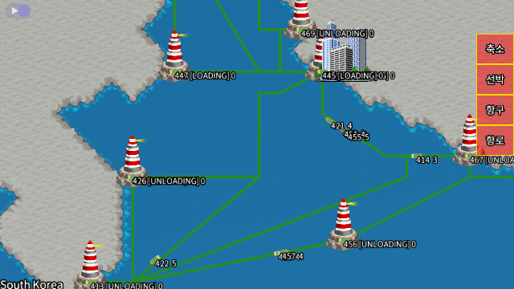
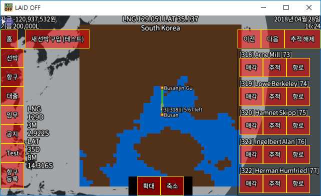
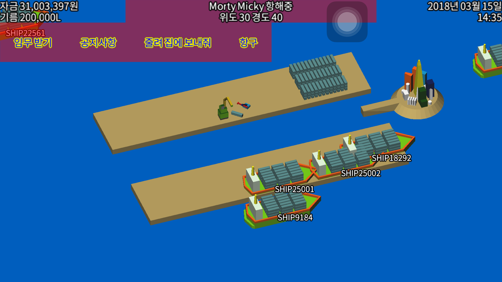
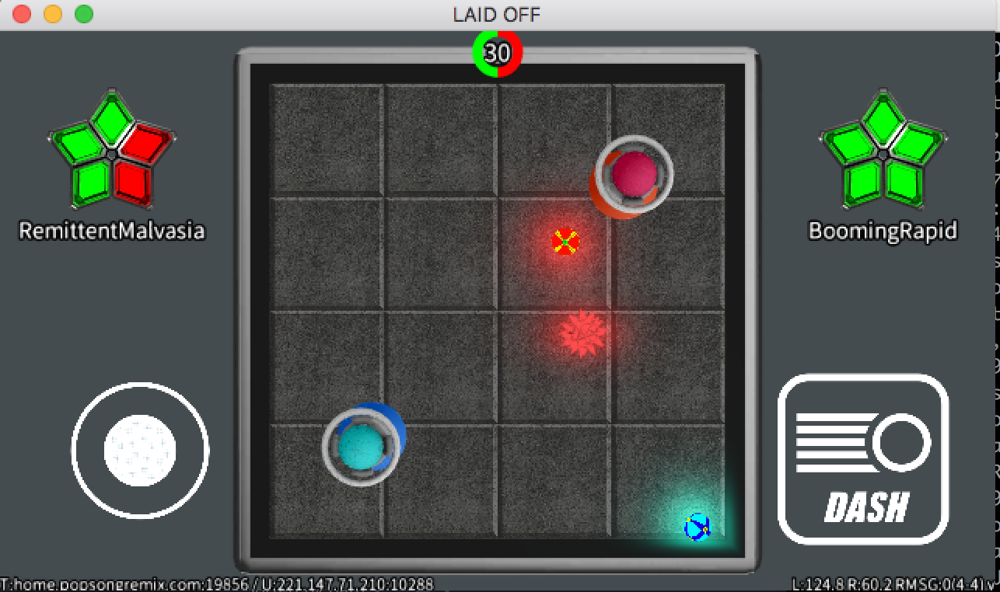
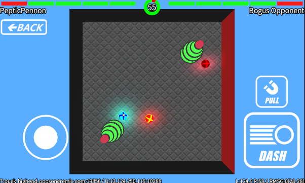
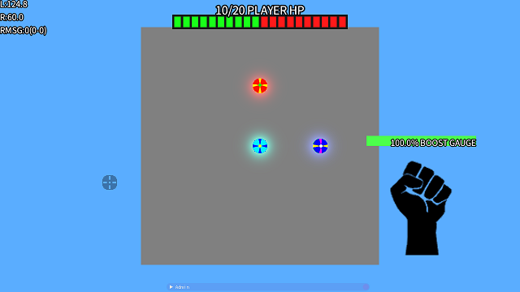
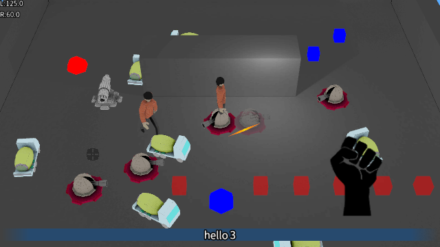
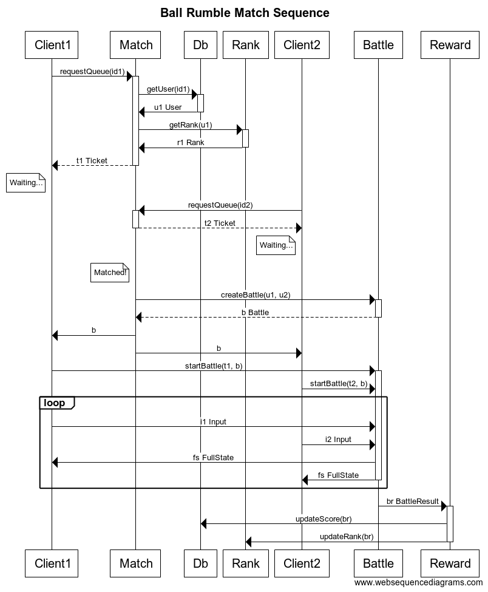

# README #

Private toy project

# What is this repository for? ##

Just playing around...

# Build HOWTO #

## Windows ##

### Build and run client ###

1. Install Visual Studio 2017 Community (with C++ support)
2. Install CMake
3. Clone this repository on `C:\laidoff`
4. Open command prompt
5. Execute: `cd c:\laidoff && mkdir build && cd build && cmake ..`
6. Open `client.sln` generated at `C:\laidoff\build`
7. Rebuild all
8. Set `laidoff` as StartUp Project
9. Run!

### Build and run server ###

#### Build `br-server` (written in Go) ####

1. Install Go
2. Set GOPATH properly
3. Open command prompt
4. Execute: `go get github.com/gasbank/laidoff/br-server`
5. Execute: `cd [GOPATH]\src\github.com\gasbank\laidoff\br-server`
6. Execute: `go get -d ./...`
7. Execute: `go build`

#### Run `br-server` ####

1. Open new command prompt
2. Execute: `cd [GOPATH]\src\github.com\gasbank\laidoff\db-server`
3. Execute: `..\br-server\br-server db`
4. Open new command prompt
5. Execute: `cd [GOPATH]\src\github.com\gasbank\laidoff\reward-server`
6. Execute: `..\br-server\br-server reward`
7. Open new command prompt
8. Execute: `cd [GOPATH]\src\github.com\gasbank\laidoff\match-server`
9. Execute: `..\br-server\br-server match`
10. Open new command prompt
11. Execute: `cd [GOPATH]\src\github.com\gasbank\laidoff\rank-server`
12. Execute: `..\br-server\br-server rank`
13. [OPTIONAL] Open new command prompt
14. [OPTIONAL] Execute: `cd [GOPATH]\src\github.com\gasbank\laidoff\push-server`
15. [OPTIONAL] Execute: `..\br-server\br-server push`

#### Build `laidoff-server` (written in C) ####

1. Proceed steps decribed in "How do I get set up? (Client on Windows)"
2. Set `laidoff-server` as StartUp Project
3. Run!

### Make client connect to localhost ###

1. Open `c:\laidoff\assets\conf\conf.json`
2. Find & Replace `p.popsongremix.com` to `localhost`
3. Run client

## Linux ##

### `laidoff-server` ###

1. Execute: `mkdir build-server && cd build-server`
2. Execute: `CXXFLAGS=-static cmake .. -DSERVER_ONLY=1`
3. Execute: `make`

### `db-server`, `match-server`, `rank-server`, `reward-server`, `push-server` ###

0. Setup GOPATH properly
1. Execute: `./batch-build-go-servers.sh`

## Diagrams ##

